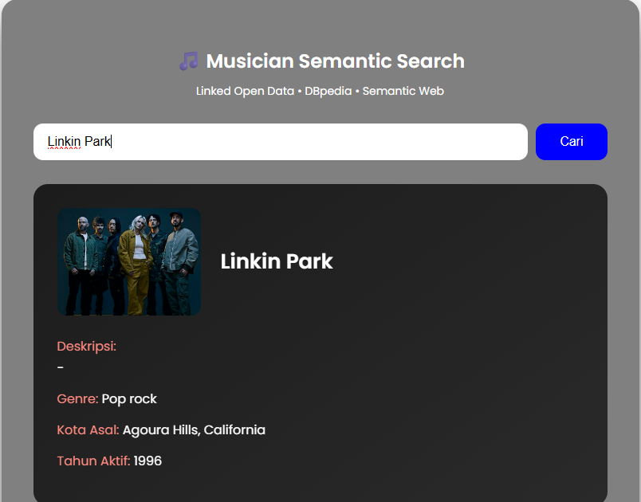

# 🎶 MUSEARCH: Musician Semantic Web Explorer

Tugas Mandiri Case Study  
Mata Kuliah Semantik Web (CPMK 4)

**Identitas Mahasiswa:**
- **Nama:** Hafidz Usman  
- **NIM:** 230101086 
- **Dosen Pengampu:** Fadli H. Wattiheluw, S.Kom., M.Kom  

---

## 📝 Deskripsi Proyek
MUSEARCH merupakan aplikasi web berbasis **Semantic Web** yang dirancang untuk melakukan pencarian informasi band dan musisi secara semantik. Aplikasi ini tidak menyimpan data secara lokal maupun menggunakan basis data konvensional, melainkan memanfaatkan **Linked Open Data** dari **DBpedia** melalui mekanisme query **SPARQL**.

Dengan pendekatan ini, data yang ditampilkan bersifat dinamis, terstruktur, dan berasal langsung dari knowledge graph DBpedia yang diekstraksi dari Wikipedia.

---

## 🚀 Fitur Aplikasi
- Pencarian band atau musisi secara real-time
- Pengambilan data langsung dari **DBpedia SPARQL Endpoint**
- Penyaringan data menggunakan ontologi semantik
- Menampilkan informasi utama musisi/band secara terstruktur

Informasi yang ditampilkan meliputi:
- Nama band atau musisi
- Deskripsi singkat (abstract)
- Genre musik
- Kota asal
- Tahun aktif
- Gambar (jika tersedia)

---

## 🛠️ Teknologi dan Sumber Data
- **Sumber Data:** DBpedia Knowledge Graph  
- **Bahasa Query:** SPARQL  
- **Frontend:** HTML5, CSS3, JavaScript  
- **Ontologi:** DBpedia Ontology (`dbo`)  

---

## 🧠 Konsep Semantic Web yang Digunakan
- **Linked Open Data (LOD)**
- **Resource Description Framework (RDF)**
- **SPARQL Query Language**
- **DBpedia Ontology**

Ontologi utama yang digunakan:
- `dbo:Band`
- `dbo:MusicalArtist`
- `dbo:genre`
- `dbo:hometown`
- `dbo:activeYearsStartYear`
- `dbo:abstract`
- `dbo:thumbnail`

---

## 📘 Dokumentasi Aplikasi

### A. Tampilan Awal (Landing Page)

![Landing Page]1.png)

---

### 🎵 Pencarian Band: Queen

---

### 🎵 Pencarian Band: Linkin Park

